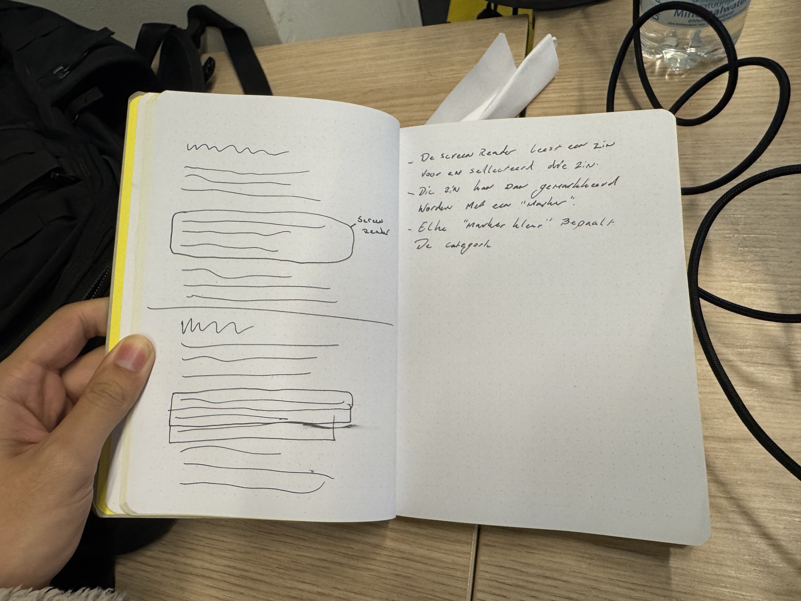

# hcd-roger

## Dag 1

Vandaag heb ik een begin gemaakt met het opzetten van de HTML-structuur. Daarnaast heb ik minimale CSS toegevoegd om het voor mezelf overzichtelijker en prettiger werkbaar te maken.

De opdracht die ik heb gekregen, is om een applicatie te ontwikkelen voor een blinde gebruiker. Deze applicatie moet het mogelijk maken om annotaties te maken tijdens het lezen van een digitaal boek. De gebruiker, Roger, is een filosofiestudent die veel leest en tijdens het lezen graag aantekeningen wil kunnen maken.

Mijn eerste idee is dat de gebruiker met behulp van een screenreader door de website navigeert. De screenreader leest delen van de tekst voor, waarna Roger deze delen kan markeren. Elke “kleurmarker” staat voor een bepaalde categorie van annotaties. Op deze manier kan Roger zijn markeringen later eenvoudig terugvinden door te filteren op categorie.

