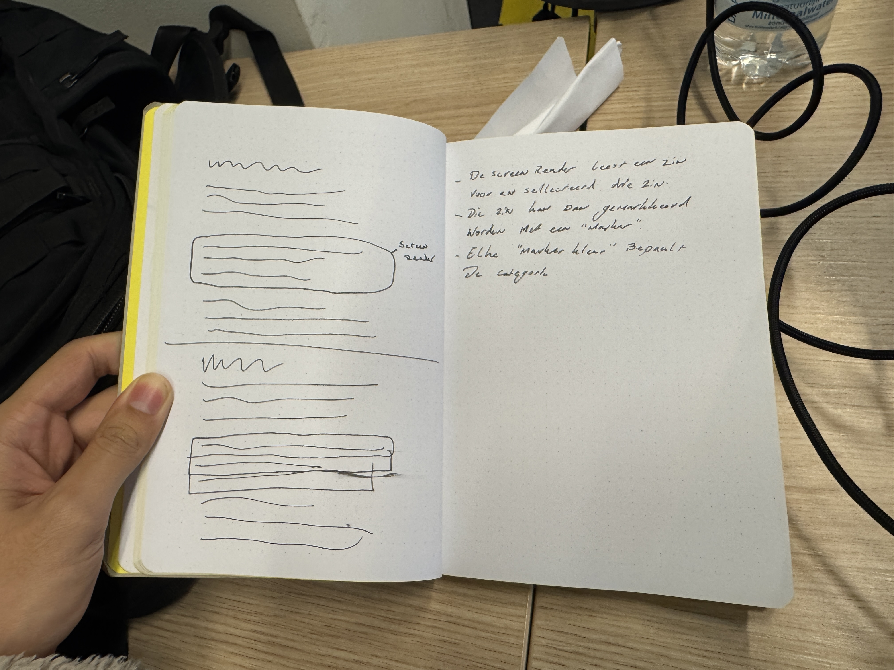

# hcd-roger

## Dag 1

Vandaag heb ik een begin gemaakt met het opzetten van de HTML-structuur. Daarnaast heb ik minimale CSS toegevoegd om het voor mezelf overzichtelijker en prettiger werkbaar te maken.

De opdracht die ik heb gekregen, is om een applicatie te ontwikkelen voor een blinde gebruiker. Deze applicatie moet het mogelijk maken om annotaties te maken tijdens het lezen van een digitaal boek. De gebruiker, Roger, is een filosofiestudent die veel leest en tijdens het lezen graag aantekeningen wil kunnen maken.

Mijn eerste idee is dat de gebruiker met behulp van een screenreader door de website navigeert. De screenreader leest delen van de tekst voor, waarna Roger deze delen kan markeren. Elke “kleurmarker” staat voor een bepaalde categorie van annotaties. Op deze manier kan Roger zijn markeringen later eenvoudig terugvinden door te filteren op categorie.

## Dag 2 (test Rogier)

vandaag ben ik aan de slag gegaan om te kijken of ik stukjes text aan de hand van de screen reader kon markeren met een kleurtje. Het werkt en verder vond ik het lastig om al een werkend concept te maken.

Verder op de dag hebben we usertest met Roger gedaan waar deze punten uit zijn gekomen:

- **Hoe maakt hij momenteel annotaties?**
  - Hij maakt wel aantekeningen maar moeite met het lezen en vinden van zijn aantekeningen.
  - Aantekeningen voor krabbels om te onthouden maar is practisch niet top omdat het na een paar dagen uitgewerkt moet worden.
  - Of hij neemt het op maar niet iedereen vond het leuk
  - Spraak vind hij wel fijn maar hij typt liever
- **Hoe leest hij een text?**
  - Met een screen reader en kan eventueel ook via de zijkant kijken
- **Wat zou je willen zien in de applicatie?**
  - Navigeren binnen de text (verhaal)
  - Mee lezen zonder dat het vermoeiend word.
  - 80% luisteren en de andere deel weten waar je bent en een beetje mee kijken/lezen.
  - zwart op geel is een prettige manier om te zien
- **Hoe zoek je momenteel je annotaties op?**
  - Vroeger met plakkertjes op de bladzijdes.
- **hou zou je je annotaties willen opzoeken?**

  - Koppel de aantekeningen aan het boek.
  - Hij kategorizeert nu per bladzijde
  - Juist per boek of per hoofdstuk
  - Koppen structuur waar de aantekeningen op gebazeerd zijn.

- **Ziet u nog kleuren?**
  - Ja, maar het is grote blurr
  - Contrast is belangrijk om de kleuren weer te geven
  - Moet wennen aan licht verschil
  - Gevoellig voor wit licht. Maar hij vind darkmodus top
- **Welke boeken/programma’s gebruikt u?**

  - Joep dohmen
  - Delikom
  - Edutekst

  - Hij leest veel op zn telefoon om het boek tot zich te nemen maar als hij leert doet hij dat op de computer.
  - Screenreaders: NVDA en supernova
  - De blindheid zit in het midden van z’n oog minder aan de zijkanten de buitenkanten wel zien
  - Hij kan niet meer lezen
  - Hij is 59 jaar
  - hij gebruikt vaak meerdere regels

## Dag 3

Vandaag ben ik bezig geweest met het verwerken van Roger feedback. Ik heb onder andere de kleuren aangepast zoals Roger dat fijn vindt, een notitieveld toegevoegd en de screen reader geoptimaliseerd.

Die screen reader was echt nog wel een klus, maar het is me uiteindelijk gelukt. Ik liep tegen het probleem aan dat de tab niet netjes de screen reader volgde. Dat is wel belangrijk, omdat mijn tekst als labels wordt gebruikt en je eigenlijk de tekst kunt “tracen” door de checkbox aan te vinken.

Doordat de tab niet goed meeliep met de screen reader, werd er soms een zin voorgelezen terwijl de tabfocus nog op iets anders zat. Daardoor werd er dus ook de verkeerde zin gehighlight.

Door bijna alles op tab index -1 te zetten en aria-hidden te gebruiken, heb ik het werkend gekregen. Daarnaast heb ik op alle checkboxes een aria-label gezet met de tekst uit de label. De label zelf is dus onzichtbaar en wordt niet meer voorgelezen, maar de checkbox wel.

Echt een bizarre workaround en rare code, maar goed… het werkt wel.

## Dag 4 (test Rogier)

Roger gebruikt een goede screenreader op zijn telefoon, waarmee hij zijn documenten makkelijk kan terugvinden en laten voorlezen. Het maken van notities gaat alleen nog niet zo goed en is lastig voor hem.

Hij gebruikt een klein extern toetsenbord dat hij op zijn telefoon aansluit, omdat hij het toetsenbord op het scherm zelf niet gebruikt. Met dit losse toetsenbord kan hij wel blind typen.

Daarnaast maakt hij gebruik van meerdere screenreaders, zodat hij niet afhankelijk is van maar één programma. Dit is handig, want soms zorgen updates ervoor dat bepaalde functies ineens niet meer werken.

Roger vindt het belangrijk dat hij zelf de snelheid van de spraak kan aanpassen naar wat voor hem prettig is.

Qua lettertypes heeft hij geen voorkeur. Op den duur ziet hij namelijk helemaal niets meer en wordt de gesproken stem voor hem het belangrijkste.

## WEEK 2

Feedback Leonie:

Pas op met de check boxes dat de screenreader niet in de war raakt of de gebruiker zelf

## Dag 5

Ik heb een `aria-label` toegevoegd aan de checkboxes en de zichtbare labels `aria-hidden` gemaakt. Hierdoor focust de screenreader alleen op de checkboxes. Door de zichtbare tekst in het `aria-label` van de checkbox op te nemen, leest de screenreader alsnog de juiste tekst voor, terwijl het interactieve element daadwerkelijk de checkbox blijft.

Ik heb dit zo opgelost omdat de tabfocus en de focus van de screenreader niet synchroon liepen. Dat kon ervoor zorgen dat de screenreader een andere zin voorlas dan het element waarop de gebruiker daadwerkelijk focus had en waarmee interactie mogelijk was. Hierdoor ontstond verwarring tijdens het navigeren en gebruiken van de website.

Met deze oplossing lopen de tabfocus en screenreaderfocus weer synchroon.

De reden dat ik de checkboxes heb behouden, ondanks dat Leonie dit had afgeraden, is omdat Rogier tijdens het testen aangaf dat hij het prettig vindt om met de Tab-toets te navigeren. Binnen de huidige structuur werkt dat goed. Daarnaast kan hij met de spatiebalk eenvoudig tekst selecteren en uiteindelijk notities maken.

## Dag 6 (test Rogier)

**Test feedback:**
Tijdens het testen gaf Rogier aan dat de toetsenbordbediening prettig werkt. Navigeren met de Tab-toets verloopt duidelijk en efficiënt, wat zorgt voor een fijne gebruikerservaring.

Daarnaast kwam naar voren dat de combinatie van rode tekst op een zwarte achtergrond moeilijk leesbaar is. 

Ook ervaarde Rogier problemen met het gebruik van VoiceOver in combinatie met Google Chrome. De screenreader focuste niet altijd op de juiste content, waardoor navigeren lastig werd.

## WEEK 3

Feedback Leonie:

Zorg dat je nog notities kan maken

## Dag 7

Rogier gaf aan dat rood op zwart moeilijk leesbaar was. Daarom heb ik deze styling zo snel mogelijk aangepast om de leesbaarheid te verbeteren.

Tijdens het testen merkte ik ook dat hij moeite had om de website goed te gebruiken met de screenreader. Vooral de combinatie van VoiceOver en Google Chrome werkte niet optimaal. De focus kwam vaak op andere elementen terecht in plaats van op de tekst, waardoor navigeren lastig werd. Dit probleem heb ik opgelost zodat de focus nu correct op de relevante content terechtkomt.

Daarnaast heb ik de mogelijkheid toegevoegd om notities te maken binnen de website. Rogier kan nu met de spatiebalk een checkbox aanvinken, waarna automatisch een notitie gemaakt kan worden. Hierdoor blijft de interactie eenvoudig en toegankelijk tijdens het navigeren met het toetsenbord.

## Dag 8 (test Rogier)

**Test feedback:**
Tijdens het testen gaf Rogier aan dat de knop te overheersend aanwezig is in de interface. Deze valt te veel op en trekt onnodig aandacht weg van de rest van de content. Daarom is er behoefte aan een subtielere oplossing.

Daarnaast mag de knop verdwijnen zodra een notitie succesvol is opgeslagen. Dit zorgt ervoor dat de interface rustiger wordt en alleen relevante acties zichtbaar blijven op het juiste moment.

Ook is er behoefte aan een duidelijke manier om te kunnen schakelen tussen de tekstweergave en de notities. Dit moet intuïtief werken zonder dat de gebruiker de context verliest tijdens het navigeren.

Tot slot gaf Rogier aan dat de tekst van de notities groter mag worden weergegeven. Dit verbetert de leesbaarheid en maakt het eenvoudiger om de inhoud snel te scannen en te gebruiken.

## WEEK 4

Feedback Leonie:

meer focussen op wat de screen reader zegt

en het moet menselijk klinken

**Wat ik heb geleerd**

- Ik heb voornamelijk geleerd hoe blinde/slechtziende mensen een website besturen en wat er door hun gedachte heen gaat bij het gebruiken van een website.
- Ik heb ook vooral geleerd wat roger fijn vind en wat en hoe gevoellig zijn ogen kunnen zijn.
- Hoe vervelend een screenreader kan zijn om te bedienen als de website niet toegankelijk genoeg is gemaakt voor een screen reader.
- Ook heb ik geleerd hoe en wat een screen reader leest en hoe je dat kan veranderen of waarom juist niet kan veranderen (volgende kopje).
- Hoe je met aria labels de screenreader andere dingen kan laten zeggen om het wat natuurlijker over komt
- En dat het belangrijk is wanner je de keuze maakt om de screenreader natuurlijk over te laten komen of juist H1 of Button laat zeggen. Want zolang het interactief is of iets zegt over de structuur van de pagina is het belangrijk om het zo te laten.

**Study situations**

Hij vertelde dat hij filosofie studeert en het liefst op zijn telefoon werkt. Ook wil hij graag aantekeningen kunnen maken, maar liever niet met spraaknotities, omdat dat storend kan zijn voor medestudenten tijdens de les. Daarom moest er een andere manier komen om dit stil en toegankelijk te kunnen doen.

**Ignore conventions**

Doordat ik checkboxes gebruikte om tekst te markeren, heb ik ze ingezet op een manier waarvoor ze eigenlijk niet bedoeld zijn. Eerst dacht ik dat dit een goede oplossing was, maar later ontdekte ik dat dit problemen veroorzaakte met de screenreader (zie hier onder). Daardoor heb ik geleerd hoe belangrijk het is om rekening te houden met toegankelijkheid en de werking van hulpmiddelen zoals screenreaders. Verder werkte het perfect als ik wilde en Roger vond het een fijne gebruikers ervaring.

**Prioritise identity**

Je merkt dat er veel verschil zit tussen mensen met een visuele beperking. Roger kon bijvoorbeeld nog wel kleuren zien, maar gaf aan dat zijn ogen erg gevoelig zijn voor licht. Daardoor besefte ik hoe persoonlijk en verschillend toegankelijkheid kan zijn per gebruiker.

**Add nonsense**

Hoewel ik niet echt “nonsense” in de website zelf heb verwerkt, heb ik hier en daar wel kleine speelse elementen toegevoegd in de code. Daarnaast heb ik geprobeerd de screenreader zo goed mogelijk te ondersteunen. De focus van de screenreader loopt gelijk met de tabfocus, waardoor de website eenvoudig te bedienen en gebruiksvriendelijk blijft.

**Wat ik de volgende keer niet meer ga doen:**

ik heb de keuze gemaakt om checkboxes te gebruiken waarbij de voice over de text voorleest en de gebruiker makkelijk met spatie de checkbox kan aan vinken waardoor de text geasseerd word en daar notities op gemaakt kunnen worden. 

Leonie had me al gewaarschuwd dat het niet de beste optie is om dat met een check box te doen omdat het daar niet echt voor bedoeld was. Aangezien dit een website voor Roger was wilde ik eerst kijken hoe Roger er mee over weg ging en dat ging goed. Hij vond het fijn te gebruiken en simpel te begrijpen. 

bij het finetunen van de voice over wilde ik de “tickbox, unticked” verwijderen omdat het voor Roger beter klinkt als het natuurlijk klinkt. Ik ben er toen achtergekomen dat alle interactieve elementen voorgelezen moeten worden en dat het dus niet kan, ook niet met aria label hidden of door de role aan te passen. 

Ik heb nu geleerd dat elk html element een functie heeft en dat je die functie ook alleen daar voor moet gebruiken en niet vervormen. 

voor nu laat ik het zoals het is.

https://chatgpt.com/share/69f32de6-7ef8-83eb-a121-f99789313875